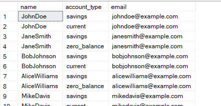
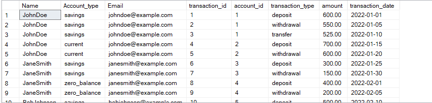
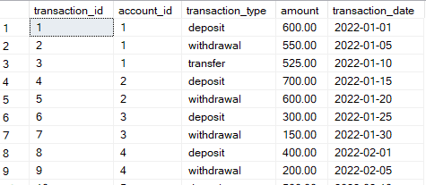
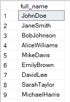
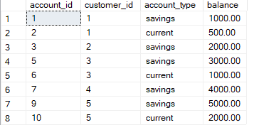
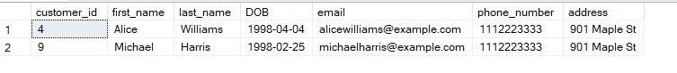
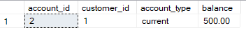
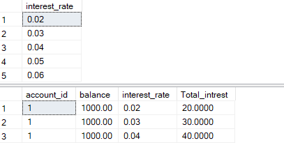
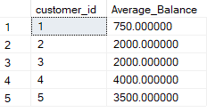

### SQL Assessment Instructions

**Assessment Overview:**
This assessment is designed to evaluate your proficiency in SQL through practical tasks encompassing data manipulation, query formulation, and complex joins and subqueries. The questions are based on a hypothetical advanced banking system that includes various types of accounts, such as savings and current accounts. Ensure to create your own data for testing your queries.

**Database Tables:**

1. **Customers:**

   - `customer_id` (Primary Key)
   - `first_name`
   - `last_name`
   - `DOB` (Date of Birth)
   - `email`
   - `phone_number`
   - `address`

2. **Accounts:**

   - `account_id` (Primary Key)
   - `customer_id` (Foreign Key)
   - `account_type` (e.g., savings, current, zero_balance)
   - `balance`

3. **Transactions:**

   - `transaction_id` (Primary Key)
   - `account_id` (Foreign Key)
   - `transaction_type` (e.g., deposit, withdrawal, transfer)
   - `amount`
   - `transaction_date`

4. **InterestRates:**

   - `interest_rate_id` (Primary Key)
   - `account_type` (e.g., savings, current)
   - `interest_rate`

5. **Branches:**
   - `branch_id` (Primary Key)
   - `branch_name`
   - `address`

**Questions:**

1. Insert at least 10 sample records into each of the following tables: `Customers`, `Accounts`, `Transactions`, `InterestRates`, `Branches`.
2. Write a SQL query to retrieve the name, account type, and email of all customers.
3. Write a SQL query to list all transactions along with the corresponding customer.
4. Write a SQL query to increase the balance of a specific account by a certain amount.
5. Write a SQL query to combine the first and last names of customers as `full_name`.
6. Write a SQL query to remove accounts with a balance of zero where the account type is savings.
7. Write a SQL query to find customers living in a specific city.
8. Write a SQL query to get the account balance for a specific account.
9. Write a SQL query to calculate the interest accrued on savings accounts based on a given interest rate.
10. Write a SQL query to find the average account balance for all customers.
11. Write a SQL query to calculate the average daily balance for each account over a specified period.
12. Identify accounts with the highest number of transactions ordered by descending order.
13. List customers with high aggregate account balances, along with their account types.
14. Identify and list duplicate transactions based on transaction amount, date, and account.
15. Calculate the total balance for each account type, including a subquery within the SELECT clause.

Please make sure to create your own data for these tables to test your queries effectively.

1. Insert at least 10 sample records into each of the following tables: `Customers`, `Accounts`, `Transactions`, `InterestRates`, `Branches`.
2. Write a SQL query to retrieve the name, account type, and email of all customers.

```sql
select concat(first_name,last_name)as
name,account_type ,email  from Customers
inner join Accounts on Customers.customer_id= Accounts.customer_id;
```



3. Write a SQL query to list all transactions along with the corresponding customer.

```sql
select concat(first_name,last_name)as
 Name,account_type as Account_type
 ,email as Email,transaction_id,
 Transactions.account_id,transaction_type,
 amount, transaction_date
 from Customers
 inner join Accounts on Customers.customer_id= Accounts.customer_id
 inner join Transactions
 on Transactions.account_id=Accounts.account_id
```



4.  Write a SQL query to increase the balance of a specific account by a certain amount.

```sql
select * from Transactions;
update Transactions
set amount=amount+500
where account_id=1
```



5.  Write a SQL query to combine the first and last names of customers as `full_name`.

```sql
select concat(first_name,last_name)as full_name from Customers
```



6.  Write a SQL query to remove accounts with a balance of zero where the account type is savings.

```sql

select * from Accounts
DELETE FROM Accounts
WHERE account_type = 'savings' AND balance = 0.00;
```



7.  Write a SQL query to find customers living in a specific city.

```sql
 select *  from Customers
 where address like '%maple%';
```



8.  Write a SQL query to get the account balance for a specific account.

```sql
select * from Accounts
 where account_id=2
```



9. Write a SQL query to calculate the interest accrued on savings accounts based on a given interest rate.

```sql
SELECT
   interest_rate
FROM
    InterestRates
WHERE account_type = 'savings';

select
   Distinct account_id,balance,
   interest_rate,(balance*interest_rate) as Total_intrest from InterestRates,Accounts
where InterestRates.account_type='savings'
```



10. Write a SQL query to find the average account balance for all customers.

```sql
select  customer_id,AVG(balance)as Average_Balance from Accounts
group by customer_id;
```



11. Write a SQL query to calculate the average daily balance for each account over a specified period.

```sql
select
      account_id,
	  AVG(balance)as Average_Balance_daily_balance
From
      Accounts
WHERE
      transaction_date BETWEEN '2022-01-30' AND '2022-02-10'
GROUP BY
      account_id
```

12. Identify accounts with the highest number of transactions ordered by descending order.

```sql
select  account_id,transaction_id from Transactions
where account_id>1
ORDER BY transaction_id DESC;
```


13. List customers with high aggregate account balances, along with their account types.

```sql
SELECT
    member_id,
    account_type,
    SUM(amount) AS total_balance
FROM
    TXN
WHERE
    created > TO_DATE('06/01/2019 00:00:00', 'MM/DD/YYYY HH24:MI:SS')
GROUP BY
    member_id,
    account_type
```

14. Identify and list duplicate transactions based on transaction amount, date, and account.

````sql
SELECT
    member_id,
    TRUNC(created, 'DDD') AS date_group,
    COUNT(*) AS count
FROM
    TXN
WHERE
    created > TO_DATE('06/01/2019 00:00:00', 'MM/DD/YYYY HH24:MI:SS')
GROUP BY
    member_id,
    TRUNC(created, 'DDD')
HAVING
    COUNT(*) > 1;
    ```


15. Calculate the total balance for each account type, including a subquery within the SELECT clause.


SELECT
    account_type,
    (SELECT SUM(amount) FROM TXN WHERE created > TO_DATE('06/01/2019 00:00:00', 'MM/DD/YYYY HH24:MI:SS') AND account_type = a.account_type) AS total_balance
FROM
    (
    SELECT DISTINCT account_type
    FROM TXN
    WHERE created > TO_DATE('06/01/2019 00:00:00', 'MM/DD/YYYY HH24:MI:SS')
    ) AS a;

````
